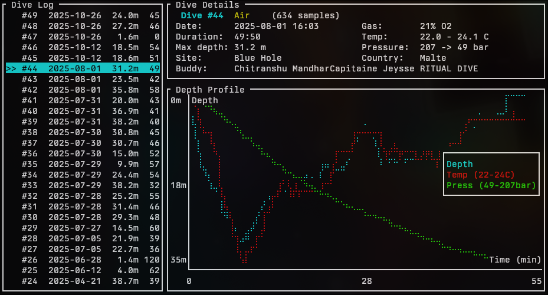

# sirius-dive

Rust CLI tool that extracts dive logs from Mares Sirius dive computers via Bluetooth Low Energy (BLE). It reverse-engineers the proprietary ECOP protocol (CANopen SDO over BLE) used by Mares GENIUS-family devices.



## Features

- **Scan** for nearby Mares BLE devices
- **Download** dive logs over BLE (incremental — skips already-downloaded dives)
- **Parse** previously saved raw binary data offline
- **Correlate** with SSI dive log CSV exports to import dive site, country, and buddy info
- **View** dive logs in an interactive TUI with depth/temperature/pressure charts

## Supported Devices

Any Mares GENIUS-family dive computer should work, including:

Sirius, Genius, Quad, Quad Air, Quad Ci, Quad2, Horizon, Smart Air, Puck Pro, Puck 2, Puck 4, Puck Air 2, Nemo Wide 2, Icon HD, Icon AIR

Tested with the **Mares Sirius**.

## Requirements

- Linux with BlueZ (BLE stack)
- Rust toolchain

## Build

```bash
cd sirius-dive
cargo build --release
```

## Usage

### Scan for devices

```bash
sirius-dive scan
sirius-dive scan --enumerate   # also list GATT services
```

### Download dive logs

```bash
sirius-dive download                          # saves to dives.json
sirius-dive download -o my_dives.json         # custom output path
sirius-dive download --save-raw raw_data/     # also save raw binary data
```

Re-running `download` is incremental — only new dives are fetched.

### Parse raw data offline

```bash
sirius-dive parse --raw-dir raw_data/
```

### Correlate with SSI export

Import dive site, country, and buddy information from an SSI dive log CSV export:

```bash
sirius-dive correlate
sirius-dive correlate --csv "my.DiveSSI.com - mydivelog.csv" --json dives.json
```

Dives are matched by exact date and time (minute-level).

### Interactive viewer

```bash
sirius-dive view
```

Navigate with `j`/`k` or arrow keys. Toggle overlays with `d` (depth), `t` (temperature), `p` (pressure). Quit with `q`.

## Protocol

The Mares ECOP protocol is documented in [FINDINGS.md](../FINDINGS.md). Key points:

- Communication happens over two GATT characteristics (write + notify) on a custom BLE service
- Commands use 2-byte headers `[cmd, cmd ^ 0xA5]`, responses are framed with `ACK (0xAA)` ... `END (0xEA)`
- Dive data is read via CANopen SDO segmented transfers
- Dive headers are 200 bytes at SDO index `0x3000+i` sub 4
- Profile data uses tagged records: `DSTR`, `TISS`, `DPRS`, `AIRS`, `DEND`
- Depth/temperature samples are at 5-second intervals in `DPRS` records

## License

MIT — see [LICENSE](LICENSE).

This project is not affiliated with Mares. Protocol details were reverse-engineered for personal use.
